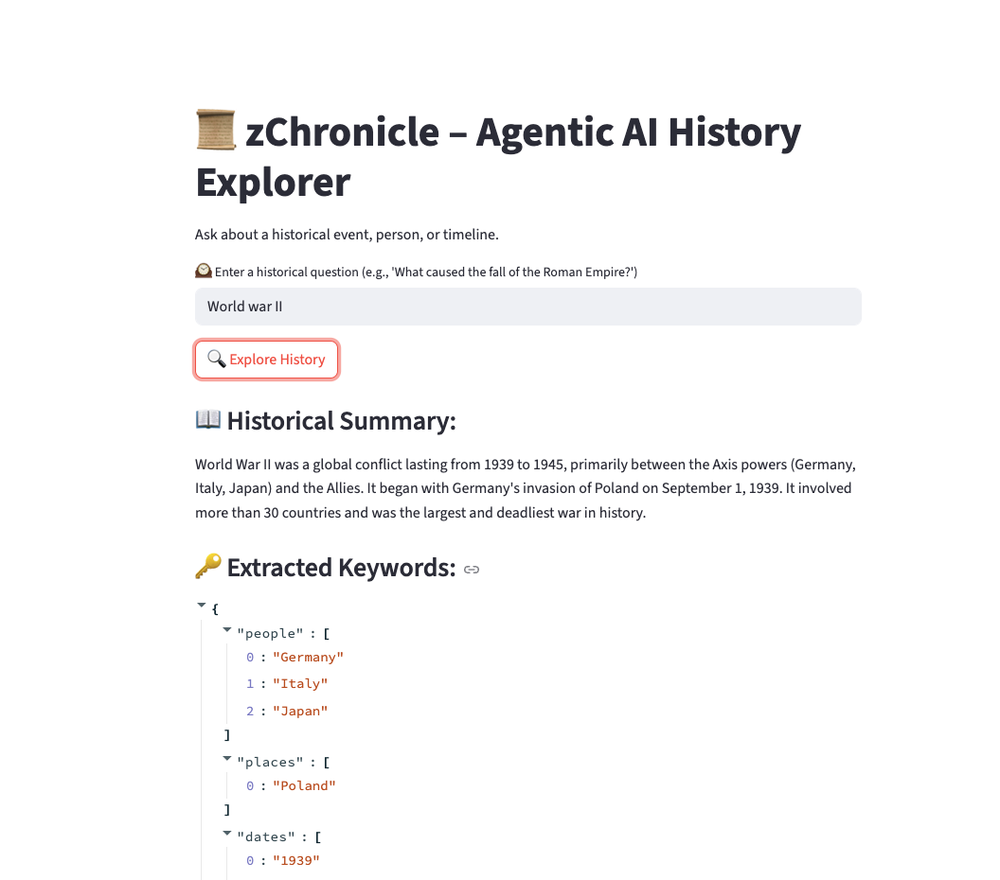
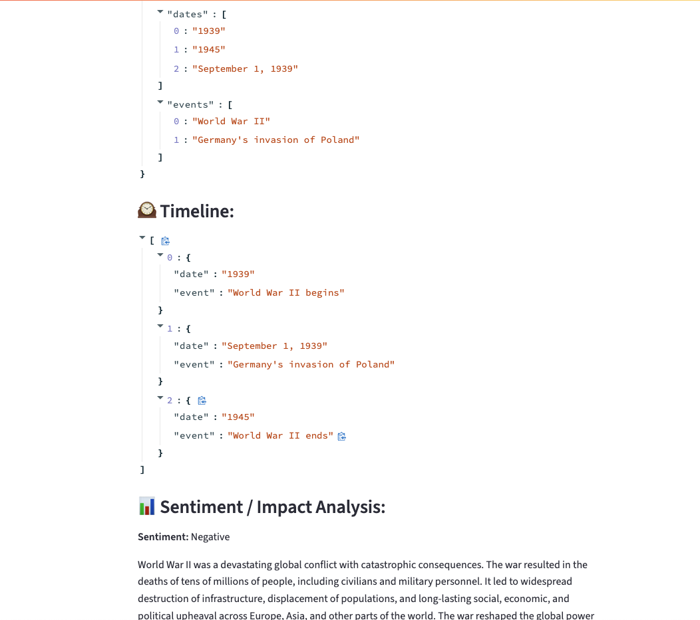
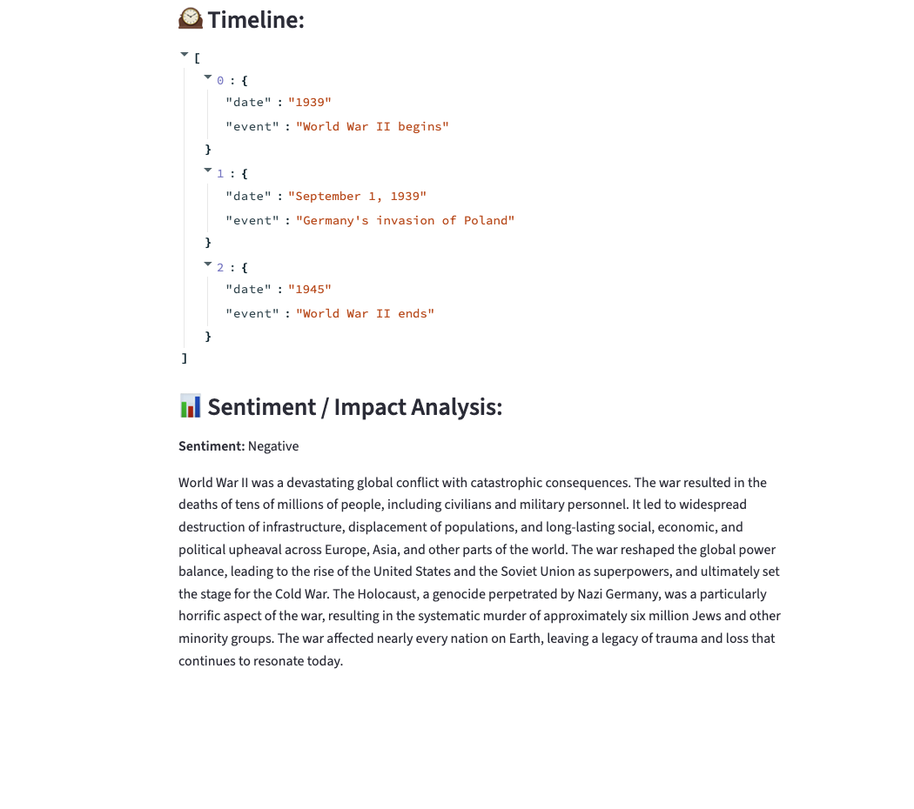

# 📜 zChronicle – Agentic AI History Explorer

zChronicle is an interactive AI app designed to help you explore history through intelligent summarization, keyword extraction, timeline construction, and sentiment analysis. It combines the power of Google Gemini with LangChain, Streamlit, and FAISS to create an engaging experience for historical research and exploration.

---

## 🚀 Features

- 🔍 Agentic historical research using Gemini + SerpAPI
- 📖 Smart summarization of complex historical topics
- 🧠 Keyword extraction for people, places, events, and dates
- 🕰️ Timeline builder that extracts chronological event data
- 📊 Sentiment & impact analysis of historical events
- 💾 Memory and vector database for knowledge persistence

---

## 🧱 Tech Stack

- Google Generative AI (Gemini)
- LangChain
- FAISS Vector Store
- SerpAPI (Web Search)
- Streamlit (UI)
- Python

---

## 📂 Project Structure

```

.
├── zchronicle\_app.py         # Main Streamlit app
├── requirements.txt
├── .env                      # Environment variables (API keys)
└── zchronicle\_faiss\_index\_store/        # FAISS vector storage (auto-generated)

````

---

## ⚙️ Setup Instructions

1. Clone the repository:
   ```bash
   git clone https://github.com/yourusername/zchronicle.git
   cd zchronicle
    ```

2. Create and activate a virtual environment:
   ```bash
   python -m venv venv
   source venv/bin/activate  # macOS/Linux
   .\venv\Scripts\activate   # Windows
   ```

3. Install dependencies:
   ```bash
   pip install -r requirements.txt
   ```

4. Create a .env file with your API keys:

   ```
   GOOGLE_API_KEY=your_google_api_key
   SERPAPI_API_KEY=your_serpapi_key
   ```

5. Run the app:

   ```bash
   streamlit run zchronicle_app.py
   ```

---

## Demo Screenshots








---

## 💡 Sample Queries

* “What caused the fall of the Roman Empire?”
* “Key events in the Cold War”
* “How did World War II begin?”

---

## 🧪 Extension Ideas

* 📊 Timeline visualizations with Plotly
* 🖼️ Image generation for historical events
* 🗃️ Export reports to PDF
* 🌍 Cross-cultural event comparison


---

## 🙏 Attribution

This project builds upon ideas and code from:

* Ardya Dipta Nandaviri – “Building an Agentic AI Research Assistant with Gemini”
  [Read the article on Medium »](https://medium.com/@ardyadipta/building-an-agentic-ai-research-assistant-with-gemini-51b901d3aea4)


---

🕰️ Made with AI, history, and curiosity.
